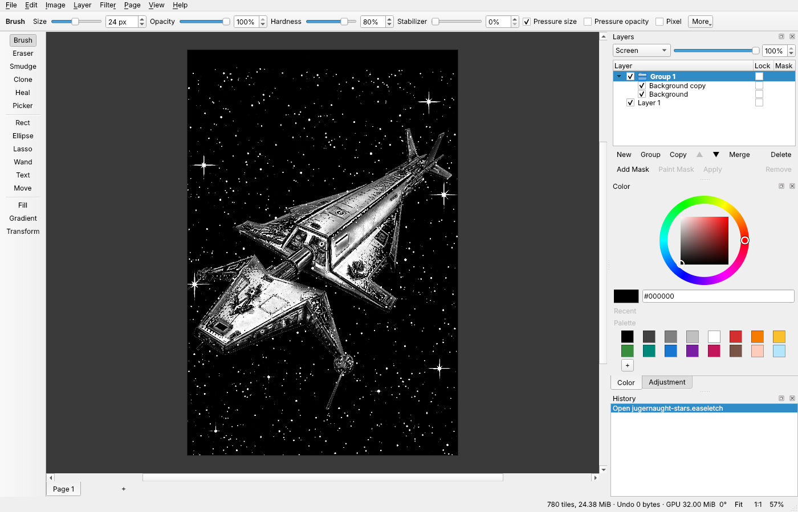

# Easeletch

A layered image editor that sits between a paint program and GIMP: easy to pick up, with the layer model, adjustment layers and blend modes of the big editors. Free and open source, for Windows, Linux and macOS.




It is built for making and reworking pictures: drawing sprites, cleaning up scanned line art and shading it, and turning photos, renders and generated images into pencil and ink drawings. The two [guides](#guides) walk through whole pieces of work from start to finish.

## Download

Packages for each release are on the [Releases page](https://github.com/scottpeterman/easel/releases).

| Platform | Package |
| --- | --- |
| Windows x64 | `Easeletch-windows-x64.zip`: unzip and run `bin/easeletch.exe` |
| Linux x86_64 | `Easeletch-linux-x86_64.AppImage`: make it executable and run it |
| macOS (Apple Silicon and Intel) | `Easeletch-macos.dmg`: see the note under [Releases](#releases) about the quarantine flag |


## Features

### Painting

- **Ready-made brushes**: the Brush button is a list of pencils (HB, 2B, 6B, mechanical), ink (fineliner, tech pen, brush pen, marker), charcoal and chalk, and paint (round, flat, filbert, dry brush, palette knife, airbrush), each shown as a sample of its stroke
- Pencil and charcoal have **grain**: a light touch only catches the high points of the paper, and pressing harder fills it in
- Flat and filbert brushes have a shaped tip that turns with the stroke, and bristles that leave streaks; the dry brush runs out of paint at a light touch
- The **palette knife** lays no paint: it pushes what is already there
- Every brush can be changed from there: size, opacity, hardness, flow, spacing and grain, and a stabilizer that steadies a shaky line
- Pen pressure for size and for opacity
- Eraser and Smudge
- Straight lines: Shift+click draws one from where the last stroke ended, and dragging on carries the stroke forward from there
- **Mirror**: paint one side and the other is painted with it, across a line down the canvas, across it, or both. The line shows on the canvas and can be put anywhere. For the brush and the eraser
- **Pixel** mode: hard 1 px pixels with no soft edge, for sprites
- Opacity caps within a stroke, so going over the same spot twice in one stroke doesn't darken it
- Strokes blend in linear light, so colours mix cleanly instead of going muddy where they meet

### Colour

- Hue ring with a saturation and value square, and hex entry
- Recent colours and a palette you can add to
- Eyedropper with a before and after ring while you pick; hold Alt in any tool to pick a colour

### Layers

- Raster layers and groups, each with visibility, lock and opacity
- 12 blend modes: Normal, Multiply, Screen, Overlay, Soft Light, Darken, Lighten, Color Dodge, Color Burn, Difference, Hue, Color
- A group is blended as one picture, so a mode set on the group applies to everything in it together
- Duplicate, merge down, merge a group, flatten, reorder by dragging
- Flip and 90° turns, exact and in one click
- **Sketch first, colour after**: a sketch layer sits on top and lets the colour painted under it show between its lines. Start one empty, or lift a sketch already drawn on the background onto one
- Every layer change is one undo step

### Layer masks

- Any layer or group can have a mask that hides part of it without erasing anything
- Paint on a mask with the ordinary brush: black hides, white shows
- A mask added while something is selected shows only the selection
- Switch a mask off, apply it or remove it

### Adjustment layers

- Levels, Curves, Hue / Saturation, Brightness / Contrast, Exposure, Black & White and Threshold
- An adjustment layer changes the look of everything below it and alters nothing: re-edit it, fade it, mask it, hide it or delete it at any time
- Inside a group it affects that group only
- The canvas updates as you drag; Curves is a line you bend by its points
- Threshold, with Soften edges, turns scanned paper white and ink black

### Selections

- Rectangle, ellipse, lasso (freehand or point by point) and magic wand
- Add, subtract, invert, grow, shrink and feather
- A feathered selection fades at its edge, and so does everything done through it
- Cut, copy, paste and move; crop to the selection; export just the selection

### Transform

- Free Transform: scale, stretch, rotate and move the selection or the whole layer, by dragging or by typing a size and angle
- Four-corner warp: tick Corners and drag each corner on its own; what's between follows in perspective, so a flat texture or a line of lettering sits on a wing, a hull side or a wall seen at an angle
- Smooth for photos and art, or hard pixels for sprites
- Redrawn from the original pixels until you apply, so trying sizes costs no quality

### Fill and gradients

- Fill by colour with a tolerance, Contiguous, and All layers (so colour can go on its own layer under line art)
- Gradients in four shapes: Linear, Radial, Reflected and Conical
- Presets: the current colour to transparent or to an end colour, shaded (highlight, colour, shadow), metals (Chrome, Steel, Gold, Copper, Gunmetal, Spun metal), armours for polished metal in a dark place (Amber, Teal, Magenta: nearly black, with one narrow band of light that shifts hue as it brightens), skies and spectrums
- A gradient editor for your own, with any number of colours, each with its own opacity, saved by name
- **Shade Areas**: finds every enclosed panel of a line drawing and lays a gradient on each at one angle, on a Multiply layer above, in soft shading or tinted metal

### Filters

- Gaussian Blur, Sharpen, Add Noise, Pixelate and Despeckle
- **Pencil Sketch**: turns a picture into a pencil drawing, clean paper in the flat areas and shading along the edges
- **Ink Sketch**: turns a picture into black line work, with the shadows filled in as far as you choose
- Live preview on the canvas; nothing is recorded until OK
- Work on the layer or its mask, inside the selection, fading with a feathered one
- Despeckle removes dust and stray dots and leaves thin lines, dashes and corners exactly as they were
- Repeat the last filter with one key

### Retouching

- **Heal**: dab a stain or scratch and it's replaced with a matching patch from nearby, toned to fit, so paper grain carries across
- **Clone**: paint with a copy of another part of the layer, to rebuild a broken line from an intact stretch

### Text

- Any font installed on the machine, any size, bold or italic, aligned left, centre or right
- Smooth, or hard-edged for pixel art
- An outline round the letters in any colour and width, so words read on any picture
- Wrap at a width: the words break to fit, and realign as you change them
- Frames for cards and captions: single line, double line, rounded, corner marks, notched corners or looped corners, in any colour and weight, with an optional fill behind the words. The frame sizes itself to the words and stays editable with them
- Comic balloons: speech, whisper (dashed), thought (a cloud with a trail of bubbles) and shout (a burst), each with a tail you aim by dragging its diamond on the canvas. A rounded box can have a tail too. Balloons size themselves to the words and stay editable with them
- Shown on the canvas as you type; placed on a layer of its own
- Placed text stays text: click it with the Text tool to change the words, font, size, colour, outline or wrap, and it's saved that way in the document. Moving the layer or cropping the canvas keeps it text; painting on it, filtering it or transforming it makes it ordinary pixels (undo brings the text back)

### Shapes

- Polygons and lines drawn point by point, with straight sides or as a smooth curve through the points, closed or open
- An outline in any colour and weight, a fill in the painting colour, or both; smooth, or hard-edged for pixel art
- **Taper**: an open line thins to a point at its start, its end or both, the way a pen stroke does as it lands and lifts
- On a curve, any point can be a sharp corner, or have its curve aimed by hand with the two handles beside it
- Shift keeps a side to 15° steps. A point put down near a point of another shape lands exactly on it (**Snap**), so lines meet with no gap for a fill to leak through
- A gradient for the fill, from the same list as the Gradient tool (the metals included), linear, radial, reflected or conical. It runs top to bottom, or out from the middle, until you aim it: open the shape and drag the diamond on either end of its line. It moves with the shape and is redrawn when a point moves
- A placed shape stays a shape: click it with the Shape tool to drag its points, add one on a side, remove one, or move the whole thing, and change its line, fill or curve. It's saved that way in the document. Moving the layer or cropping the canvas keeps it a shape; painting on it, filtering it or transforming it makes it ordinary pixels (undo brings the shape back)

### Pages

- One document holds any number of drawings, as tabs under the canvas
- Each page has its own canvas size, layers, undo history and view
- Copy on one page and paste on another; duplicate a page to try a variation
- Rename a page by double-clicking its tab, reorder by dragging it; right-click a tab for the rest
- **Papers**: a new page or image can be a sheet of cotton, cold press, cream, parchment, sepia, kraft, grey or black paper, each with its own surface. The paper is a locked layer under the drawing, so erasing never rubs it away, and it's part of what's exported

### Sprite work

- Pixel brush, whole-pixel zoom steps, and a pixel grid from 600%
- Sprite grid with cell size, offset and snapping
- Color to Alpha, Trim transparent edges, and Export Selection as PNG

### Canvas, undo and files

- GPU canvas (Direct3D 11 on Windows, Metal on macOS, OpenGL on Linux) with pan, zoom and rotate
- 16-bit float colour in linear light throughout, so repeated edits and saves don't lose quality
- Unpainted areas take no memory or disk space
- Undo keeps only what each step changed, within a 1 GB budget; the History panel jumps to any step
- Undo and Redo buttons at the foot of the tool strip, for a tablet with no keyboard
- **Paper Only** (View menu, F11): full screen with nothing but the drawing. A small strip on the canvas keeps undo and redo, the brush list, the eraser, the Color and Layers panels and the way back, so it works on a tablet with no keyboard; drag the strip out of the way by its edge
- Fits a small screen: on a 12" tablet the tool options that don't fit go behind a **>>** button at the end of the bar, and a long palette scrolls
- Opens PNG, JPEG, WebP and other common image formats; exports PNG, JPEG and WebP
- `.easeletch` documents keep every layer, mask, adjustment and page, and include a preview image other programs can read
- Opening, saving and exporting run in the background; a failed save never damages the previous file

### Not there yet

Not built yet, roughly in the order planned:

- Mesh warp: a grid of points to bend a texture round a curved panel, such as a car door or a fuselage
- Layer effects
- Autosave

## Guides

Whole jobs, step by step, with pictures.

- [Restoring old ink art](docs/restoring-ink-art.md): from a photo of an ink drawing on aged paper to clean line work, then shading under the lines.
- [From a render to an ink plate](docs/render-to-ink-plate.md): a detailed colour picture turned into pencil and ink, the two combined, and a background put behind it.
- [Metal on a line drawing](docs/metal-on-line-art.md): an ink drawing of a machine given dark polished plates, trim in a second colour, lettering laid on a slanted side, and a dark page behind it.

## Keys and controls

### Files and pages

| Action | Input |
| --- | --- |
| New / Open | Ctrl+N / Ctrl+O (Easeletch documents and images) |
| Save / Save As | Ctrl+S / Ctrl+Shift+S |
| Export PNG, JPEG or WebP | Ctrl+Shift+E |
| Export selection as PNG | Ctrl+Alt+E |
| New page | Ctrl+Alt+N, or **+** beside the page tabs |
| Next / previous page | Ctrl+PgDown / Ctrl+PgUp, or click a tab |
| Rename, reorder, duplicate, delete a page | Double-click the tab, drag it, right-click it; or the Page menu |

### Painting and colour

| Action | Input |
| --- | --- |
| Paint | Left-drag or pen |
| Brush / Eraser / Smudge / Eyedropper | B / E / S / I |
| Choose a pencil, pen or charcoal | The arrow on the Brush button, or press the button again once the brush is in use. Choosing one sets the brush to it, size included |
| More or less paper showing through | **Grain** under **More** in the tool options |
| Undo / redo without a keyboard | **Undo** and **Redo** at the foot of the tool strip; hold Undo to keep going back |
| Smaller / larger brush | [ / ] |
| A straight line | Shift+click: from where the last stroke ended to the click |
| Paint both sides at once | **Mirror** in the tool options: Left / right, Top / bottom or Both. The line is in the middle of the canvas; **More** has where it sits, and **Centre** to put it back |
| Pick a colour from any tool | Hold Alt and click or drag (with the Clone tool, Alt+click sets what to copy instead) |
| Hard 1 px pixels (sprites) | Tick **Pixel** in the tool options |
| Clone | C; hold Alt and click what to copy, then paint it somewhere else |
| Heal | H; dab or drag over a blemish and let go |
| Text | T; click where it goes, type in the Text window, drag on the canvas to move it. Ctrl+Enter (or Place) puts it on a new layer; Escape or Cancel drops it |
| Change placed text | With the Text tool, click the words. The Text window opens with them; Ctrl+Enter (or Update) keeps the change, Escape drops it |
| Draw a shape | U; click point by point (hold and drag to place a point exactly). Click the first point, double-click, or press Enter to finish; Backspace takes back the last point; Escape drops it |
| Change a placed shape | With the Shape tool, click it. Drag a point to move it, a side to add a point there, inside to move the shape; Delete removes the point last touched. Enter (or a click away from it) keeps the change, Escape drops it |
| An inked line | Shape tool with **Closed** off and **Curved** on, then **Taper**: the first box thins the start, the second the end |
| A sharp corner in a curve, or a curve aimed by hand | Open the shape and click a point. Ctrl+click it for a corner (again for a curve). Drag either of the small diamonds beside it to aim the curve through it |
| Start a line on another shape's corner | Ctrl+click there: a plain click would open that shape. With **Snap** ticked the new point lands on the corner |
| Fill a shape with a gradient | In the Shape options, tick Fill and Gradient and pick one from the list. To aim it, click the shape with the Shape tool and drag the diamonds at the two ends of the gradient's line |
| Aim a balloon's tail | While the Text window is open, drag the diamond at the tail's tip |
| Move placed text (or any layer) | With the Text tool, drag on the canvas; or the Move tool (V) |

### Layers and masks

| Action | Input |
| --- | --- |
| New layer / duplicate / group | Ctrl+Shift+N / Ctrl+J / Ctrl+G |
| Start a sketch | Layer > New Sketch Layer (Ctrl+Shift+K): an empty layer on top, with a pencil |
| Colour under a sketch | Select the sketch, then Layer > New Layer Below (Ctrl+Shift+B) and paint |
| Colour a sketch already drawn on the background | Layer > Sketch from This Layer: the sketch goes on top with a new Color layer under it, ready to paint |
| Merge down (or merge a group) | Ctrl+E |
| Show, lock, rename, reorder a layer | Layers panel: tick the box, tick Lock, double-click the name, drag the row (onto a group to put it inside) |
| Layer blend mode and opacity | Top of the Layers panel |
| Delete layer | Delete key when nothing is selected on the canvas (with a selection, Delete clears the selected pixels), the panel's Delete button, or the Layer menu |
| Move layer up / down, flatten | Layers panel buttons, or the Layer menu |
| Flip, rotate 90° or 180° | Layer menu, or the buttons in the transform options |
| Add a layer mask | Layers panel: Add Mask (from the selection, if there is one) |
| Paint on the mask / on the layer | Ctrl+M, or Paint Mask in the Layers panel |
| Switch a mask off, apply or remove it | Layers panel: the Mask tick box, Apply, Remove |

### Selections

| Action | Input |
| --- | --- |
| Rectangle / ellipse select | M / Shift+M; drag, Shift for square or circle, click to deselect |
| Lasso | L; drag around something and let go, or click point by point and press Enter (or click the first point). Escape gives up. Shift adds, Ctrl subtracts |
| Magic wand | W; click selects similar colour, Shift+click adds, Ctrl+click subtracts |
| Select all / deselect | Ctrl+A / Ctrl+D |
| Invert selection | Ctrl+Shift+I |
| Grow / shrink selection | Edit > Grow Selection, Shrink Selection |
| Feather selection | Shift+F6 |
| Cut / copy / paste / delete | Ctrl+X / Ctrl+C / Ctrl+V / Delete |
| Move selected pixels | V, then drag; arrows nudge 1 px, Shift+arrows 10 px |
| Drop / cancel floating pixels | Enter / Escape. Pasted pixels are outlined only while you place them: once dropped, nothing is selected |
| Tools do nothing, or only in one spot | Something is still selected (the status bar shows its size): Ctrl+D deselects |
| Crop to selection | Ctrl+Shift+X |
| Trim transparent edges | Ctrl+Alt+T |
| Color to Alpha | Ctrl+Alt+A (in the selection, or the whole canvas) |

### Transform, fill and gradient

| Action | Input |
| --- | --- |
| Warp by the corners | Ctrl+T, then tick Corners in the options. Drag a corner to put it where it goes; inside to move all four; arrows nudge. Enter applies, Escape cancels. Flip or turn first: those are off while Corners is on |
| Free transform | Ctrl+T (the selection, or the whole layer). Drag a corner to scale, Shift for any shape; a side to stretch; outside the box to rotate, Shift for 15° steps; inside to move; arrows nudge. Enter applies, Escape cancels |
| Fill | G; click an area. Tolerance, Contiguous and All layers in the tool options |
| Fill the selection (or the layer) with the current colour | Shift+F5 |
| Gradient | Shift+G; drag from start to end, Shift for 45° steps. Colours (presets, metals, your own), shape (Linear, Radial, Reflected, Conical) and Reverse in the tool options |
| Edit a gradient | Edit… in the gradient options: click the bar to add a colour, drag a marker to move it, Delete removes it. Save as Preset keeps it in the list |
| Shade every panel of a line drawing | Layer > Shade Areas. Lasso loosely round a group of panels first to shade only those |

### Adjustments and filters

| Action | Input |
| --- | --- |
| Add an adjustment layer | Layer > New Adjustment Layer, or the buttons in the Adjustment panel (it shares a tab with Color) |
| Change an adjustment | Select its layer: its settings are in the Adjustment panel. Curves: click the line to add a point, drag to bend, drag a point off the square to remove it |
| Limit an adjustment to an area | Select the area, then Add Mask on the adjustment layer; or paint on its mask |
| Filters | Filter menu: Gaussian Blur, Sharpen, Add Noise, Pixelate, Despeckle, Pencil Sketch, Ink Sketch. Ctrl+Alt+F repeats the last one |
| Turn a picture into a drawing | Filter > Pencil Sketch or Ink Sketch. For ink, set Ink first, then Line width |
| Clean up a scan | Add a Threshold adjustment layer and set its level, Merge Down, then Filter > Despeckle |

### View

| Action | Input |
| --- | --- |
| Pan | Middle-drag, or hold Space and drag |
| Zoom at cursor | Mouse wheel (whole-pixel steps above 100%: 200%, 300%, 400%...) |
| Fit to window | Ctrl+0 |
| Actual pixels | Ctrl+1 |
| Rotate view | Shift + wheel, or Ctrl+[ and Ctrl+] |
| Reset rotation | Ctrl+Shift+R |
| Pixel grid (from 600%) | Ctrl+' |
| Sprite grid on / off | Ctrl+Shift+' (cell size, offset and snapping under View > Sprite Grid Settings) |
| Undo / Redo | Ctrl+Z / Ctrl+Shift+Z or Ctrl+Y |

## How it works

The canvas draws through QRhi from a sparse tile store: 64×64 tiles of RGBA16F in linear light. Layers are composited on the CPU, tile by tile, into the store the canvas draws. Normal blending and opacity mix in linear light; the other blend modes compare colours as sRGB values, so they give the results other editors do. Blur and Sharpen also work in linear light, so colours don't darken where they meet and nothing bleeds out of transparent areas.

## Files

Easeletch saves `.easeletch` documents: a zip with a `manifest.json` (canvas size and the layer list: name, group, visibility, lock, opacity, blend mode, mask, and an adjustment layer's settings), a flattened `preview.png` (up to 2048 px) you can look at without Easeletch, and each layer's and mask's tiles stored exactly (16-bit float, linear light), so saving and reopening never loses quality. Areas you haven't painted take no space. Saves and exports run in the background, and a failed save never damages the previous file. Export writes a full-size flattened PNG, JPEG or WebP.

The app was called Easel before 0.2.0: `.easel` files from then still open, and saving one asks for a new `.easeletch` name. Documents saved before layers (format 1) open as a single layer. Documents with adjustment layers are saved as format 4, which builds before 0.4 decline to open; without any they are still format 3 (layers and masks), which every build since 0.2 opens. A document with a Threshold layer is format 6 and needs 0.5 or later.

## Build

Requires CMake 3.21+, Ninja, a C++20 compiler and Qt 6.7+ with the Qt Shader Tools module. CI and releases use Qt 6.10.3.

On Linux and macOS, `scripts/build.sh` configures, builds and runs the tests. On Windows, `scripts\build-windows.bat` does the same (see below). It finds Qt at `~/Qt/6.10.3/gcc_64` (Linux) or `~/Qt/6.10.3/macos` by default, and wipes a build directory that was configured from another source tree, another Qt or another generator.

```
scripts/build.sh
scripts/build.sh --run
scripts/build.sh --qt ~/Qt/6.10.2/gcc_64
scripts/build.sh --clean
scripts/build.sh --appimage
scripts/build.sh --dmg
```

`--appimage` writes `dist/Easeletch-linux-x86_64.AppImage`; `--dmg` writes `dist/Easeletch-macos.dmg`. CI runs the same script. `--debug` builds into `build-debug/` and `--no-tests` skips ctest.

If Qt reports no Shader Tools module, add it:

```
aqt install-qt linux desktop 6.10.3 linux_gcc_64 --noarchives -m qtshadertools -O ~/Qt
```

On Windows, `scripts\build-windows.bat` takes the same options, with `--zip` (writes `dist\Easeletch-windows-x64.zip`) in place of `--appimage`/`--dmg`. It runs from a plain cmd prompt: it loads the x64 MSVC environment itself through vswhere, finds Qt at `C:\Qt\6.10.3\msvc2022_64` (or the newest `C:\Qt\6.*\msvc*_64`), and takes Ninja and CMake from PATH, Visual Studio or `C:\Qt\Tools`. Needs Visual Studio 2022 or its Build Tools with "Desktop development with C++".

```
scripts\build-windows.bat
scripts\build-windows.bat --run
scripts\build-windows.bat --qt C:\Qt\6.10.3\msvc2022_64
scripts\build-windows.bat --zip
```

If your Qt came over from another project without Shader Tools, add it with the Qt Maintenance Tool (Additional Libraries > Qt Shader Tools) or:

```
aqt install-qt windows desktop 6.10.3 win64_msvc2022_64 --noarchives -m qtshadertools -O C:\Qt
```

Manual build, any platform:

```
cmake -S . -B build -G Ninja -DCMAKE_BUILD_TYPE=Release -DCMAKE_PREFIX_PATH=/path/to/Qt/6.10.3/gcc_64
cmake --build build
ctest --test-dir build --output-on-failure
```

## Releases

Every push to `main` builds and tests on Linux, Windows and macOS and uploads packages as workflow artifacts. Pushing a `v*` tag also publishes a GitHub release. Push the release commit and its tag together, so it's built once and not twice:

```
git tag v0.13.1
git push --atomic origin main v0.13.1
```

| Platform | Package |
| --- | --- |
| Linux x86_64 | `Easeletch-linux-x86_64.AppImage` |
| Windows x64 | `Easeletch-windows-x64.zip` (run `bin/easeletch.exe`) |
| macOS (Apple Silicon + Intel) | `Easeletch-macos.dmg` |

The macOS build is ad-hoc signed, not notarized. After copying it to Applications, clear the quarantine flag once or macOS reports it as damaged:

```
xattr -dr com.apple.quarantine /Applications/Easeletch.app
```

## Layout

```
src/core   tile store and color math, no widgets (easeletch_core)
src/ui     canvas view, main window, panels (easeletch_ui)
src/app    executable, icon, install and deploy rules
scripts    build.sh (Linux, macOS) and build-windows.bat: build, test and package
tests      Qt Test suites; CPU tests run offscreen, GPU tests need a display
```

## Licence

GPL version 3. See [LICENSE](LICENSE). Built with Qt 6; Help > About Qt in the app has the details.
