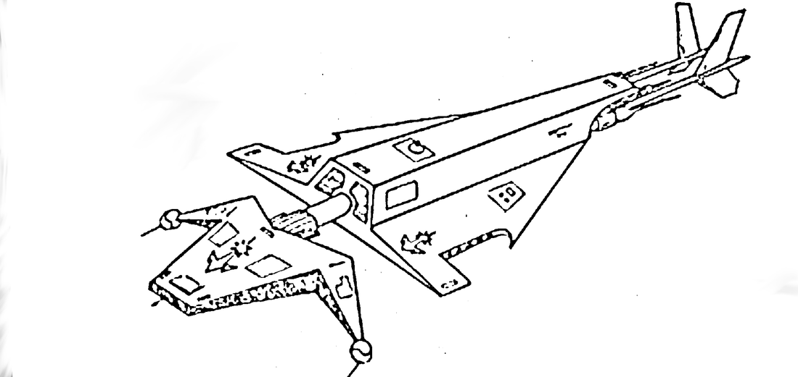
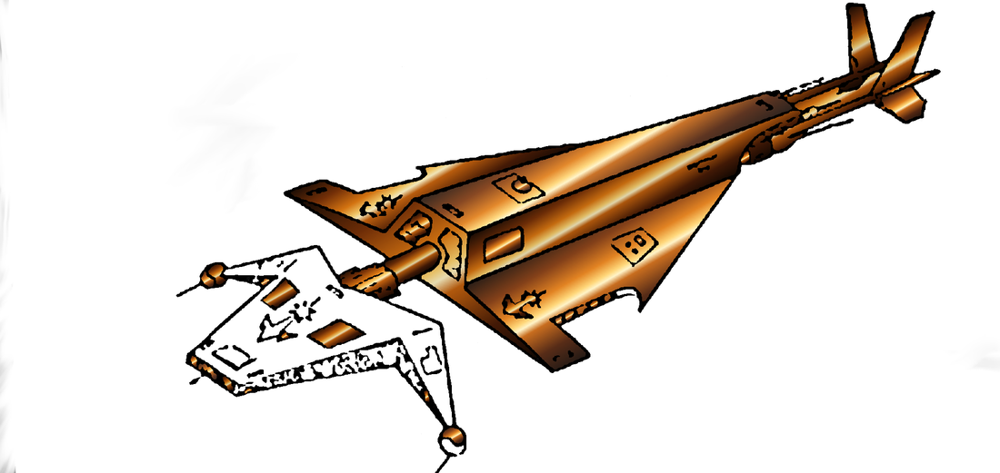
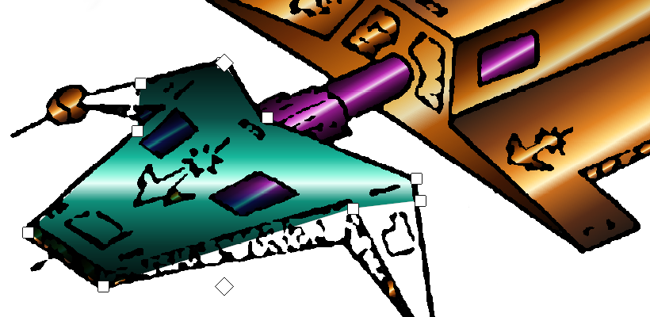

# Metal on a line drawing

How to take a black-and-white ink drawing of a machine and give it the look of polished metal: dark plates with a band of light across each, accents in a second colour, lettering laid on a slanted side, and a dark page behind it. Needs Easeletch 0.10 or later.

The drawing used here is a ship in ink on white, 1919 x 909 pixels. Any line drawing made of closed panels works the same way.

What makes metal look rich is less the drawing than the colours. Three things do most of it:

- **Most of it is nearly black.** Colour looks strong only next to dark.
- **The light is one narrow band** on each surface, not a slow fade from one side to the other.
- **The highlight changes hue as it brightens**: orange goes to gold and then to pale yellow, not just to a lighter orange.

The three *armour* gradients (Amber, Teal, Magenta) are built that way, and this guide uses them. The grey metals (Steel, Chrome, Gunmetal) follow the same steps and give brushed metal in daylight instead.

## 1. Open the drawing and clear the specks

1. **File > Open** (Ctrl+O) and pick the image. Double-click the layer's name and call it *Ink*.
2. Press **Ctrl+D** so nothing is selected.
3. Choose **Filter > Despeckle** and raise **Speck size** until the stray dots in the open areas are gone; the example uses 40. Leave **Tolerance** at 15% and click OK.
4. **File > Save As** and give it a name, so Ctrl+S keeps the layers from here on.

If the drawing is a scan on grey or brown paper, clean it first with [Restoring old ink art](restoring-ink-art.md).

## 2. Shade every panel at once

**Layer > Shade Areas** finds every area closed in by lines and lays a gradient on each, on a new layer set to Multiply above the ink. The ink itself isn't touched.

1. Click *Ink* in the Layers panel and choose **Layer > Shade Areas**.
2. Set **Gradient** to *Amber armour*.
3. Set **Angle** to the way the light falls across the panels. The gradient runs across each panel in that direction, so pick one that crosses the panels the short way: on this ship, which runs from lower left to upper right, that is 60°.
4. Set **Variation** to about 30%, so neighbouring plates differ a little and don't merge into one sheet.
5. Lower **Skip areas under** to 60 px so the small hatches are shaded too.
6. Watch the preview, then click OK.

Each panel gets the whole gradient fitted across it, so every plate has its own dark edges and its own band of light.

Two things to look for in the preview:

- **A panel left white** has a gap in its outline. It isn't closed in, so it counts as part of the page. Here that's the forward plate, whose rough lines have several breaks. Step 4 deals with it.
- **The page itself shaded** means the gap is in the outer outline and a panel has joined the page the other way round. Cancel, close the gap with a small brush stroke in black on *Ink*, and run it again.

## 3. Pick out the trim in a second colour

Shade Areas run again with something selected shades only the areas that are mostly inside the selection, and replaces what was on them. That turns chosen parts a different metal without touching the rest.

1. Click *Ink* in the Layers panel.
2. Press **M** and drag a rectangle loosely round one part: an engine nozzle, a hatch, the barrel. It only needs to be mostly inside. For an awkward shape, press **L** and click round it with the Lasso.
3. Choose **Layer > Shade Areas**, set **Gradient** to *Magenta armour*, lower **Variation** to 15%, and click OK.
4. Repeat for each part. The dialog remembers its settings, so each one after the first is select, open, OK.
5. Press **Ctrl+D** when done.

Keep the second colour to small things. A body in one warm colour with a few cool accents looks designed; half and half looks like two ships.

## 4. Cover an open panel with a shape

For a big panel whose outline won't close, drawing a shape over it is quicker than hunting for every gap. A shape's fill can be a gradient, and the shape stays editable.

1. Click the top layer in the Layers panel, so the shape lands above the shading.
2. Press **U** for the Shape tool. In its options set **Line** to *None*, tick **Fill** and **Gradient**, and pick *Teal armour* from the list beside them.
3. Click round the panel, corner by corner, just inside the outer edge of its ink line. Hold and drag on a click to place a point exactly. Press **Enter** to finish (or click the first point again).
4. In the Layers panel, set the new layer's blend mode to **Multiply**. The ink shows through it, as it does through the shading.

To adjust it, click the shape with the Shape tool. Its corners come back as squares:

- Drag a corner to move it; drag a side to add a corner there; **Delete** removes the one last touched.
- Drag the two **diamonds** to aim the gradient: they are the ends of its line. Pull them closer together for a tighter band of light, or turn the line to change where the light falls.
- **Enter** keeps the change, **Escape** drops it.

Because the layer is on Multiply, a shape that runs a little past the ink line in places doesn't show against a dark page. Against a white page it does, so keep the corners inside the line.

## 5. Lay lettering on a slanted side

Text goes on flat and is then pulled into place by its corners, so it follows the side it sits on.

1. Pick a dark colour close to the darkest of the metal (the example uses `#1a0d05`).
2. Press **T**, click on an empty part of the canvas, type the name in the Text window, choose a bold font at about 46 px, and click **Place**.
3. Press **Ctrl+T** for Transform and tick **Corners** in its options.
4. Drag each corner of the box to where that corner of the lettering belongs on the hull: the two left corners onto the near end of the side, the two right corners onto the far end. What's between follows in perspective, so the letters get smaller as the side goes away.
5. Press **Enter** to apply, then set the layer's blend mode to **Multiply**.

Check the spelling before step 3. Once transformed, text is ordinary pixels and can't be retyped; **Ctrl+Z** brings the text layer back if you need to.

Flat artwork goes on the same way: paste a decal or a strip of plating, press Ctrl+T, tick Corners, and put its corners on the corners of the surface.

## 6. Put a dark page behind it

On white, dark metal looks heavy and its colour flat. A dark page is what lets the band of light on each plate read as light.

1. Press **Ctrl+Shift+N** for a new layer and call it *Backdrop*. Leave it at the top, on Normal.
2. Press **G** for the Fill tool. In its options tick **All layers** and set **Tolerance** to about 25%.
3. Pick a near-black with a little blue in it (the example uses `#0b0c12`).
4. Click on the page, well away from the drawing. The page fills up to the drawing's outline.
5. Click any scraps of white left between the struts and along rough edges: places closed off from the page that weren't panels either.

With **All layers** ticked, the Fill tool finds the area by looking at the whole picture but paints on the layer you're on. That's why the page is filled and the ship isn't: the ship is no longer white.

**File > Export** (Ctrl+Shift+E) writes a PNG.

## What's in the document

Bottom to top, with what each can still do:

| Layer | Blend | What it is |
| --- | --- | --- |
| *Ink* | Normal | The drawing. Nothing above has changed it. |
| *Shading 1* | Multiply | Everything Shade Areas made. Delete it to start the shading again. |
| *Nose plate* | Multiply | A shape. Click it with the Shape tool to move its corners or re-aim its gradient. |
| The lettering | Multiply | Pixels, since the transform. |
| *Backdrop* | Normal | The dark page. Hide it to see the ship on white again. |

## Taking it further

- **Hot edges.** Add a layer above the shading set to **Screen**, pick a pale yellow, and with a 2 or 3 px brush run a thin stroke beside the ink line along the edges that face the light. This is what makes a seam look as if it catches the light.
- **Glow.** Duplicate that layer (Ctrl+J), run **Filter > Gaussian Blur** on the copy at 6 to 10 px, and leave both on Screen. The blurred copy spreads the highlights outward.
- **Your own metal.** In the Gradient tool's options click **Edit…**, build a ramp that is near-black at both ends with a narrow light band whose colour shifts as it brightens, and save it. It's then in the Gradient tool's list and the Shape tool's. Shade Areas offers the built-in gradients only; to use your own across many panels, shade them with a built-in one and tick **Tint with the current colour**, or fill the panels as shapes.
- **Faces turned away.** Lasso the panels on the shaded side of the object and run Shade Areas on them again with **Brightness** lowered by 20 to 30%.

## When something goes wrong

| What happens | Why, and what to do |
| --- | --- |
| Shade Areas says it found nothing | Something is selected and no area is mostly inside it, or the drawing's outline is open to the page. Press Ctrl+D and try again; if it still finds nothing, close the gaps in the outer outline. |
| A panel stays white | Its outline has a gap. Close it with a small black brush stroke on *Ink* and run Shade Areas again, or cover the panel with a shape (step 4). |
| Two panels come out as one | The line between them has a gap. Close it and run Shade Areas again. |
| Every plate is the same flat colour, with no dark edges | The gradient is running the long way along the panels. Change **Angle** by 90°. |
| The Gradient tool fills the whole layer, not the shape | The Gradient tool fills the selection or the layer. A shape's gradient is set with the Shape tool: click the shape, then tick Fill and Gradient in the options. |
| Gradient is greyed out in the Shape options | **Fill** isn't ticked. |
| A corner won't go where it's dragged in Transform | It would fold the shape over itself. Move the other corners first. |
| Width, height and angle are greyed out in Transform | **Corners** is ticked. Scale, flip or turn before ticking it. |
| Fill covers the ship as well as the page | **Tolerance** is too high, or the fill was clicked on the ship. Undo, lower it, and click on the page. |
| Fill stops short and leaves a pale fringe round the page | The page isn't an even white. Raise **Tolerance** a little, or click the pale patches as well. |
