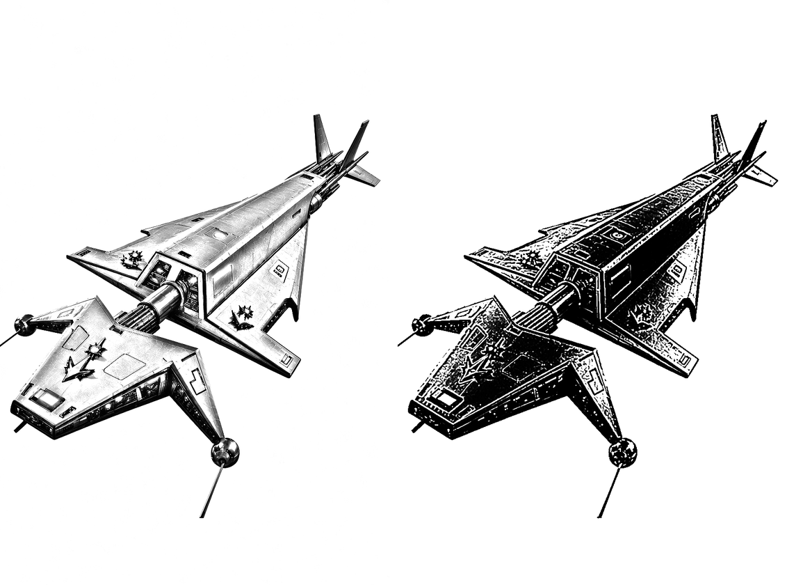
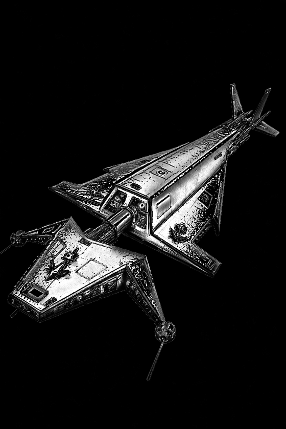
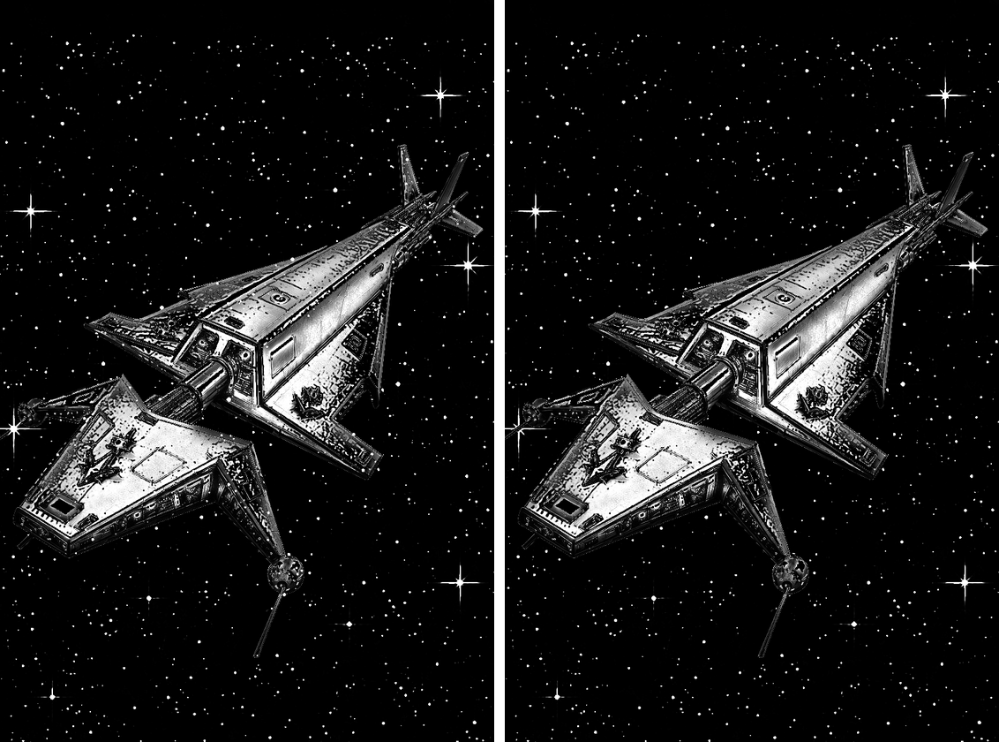

# From a render to an ink plate

How to take a detailed, full-colour picture (a 3D render, a generated image, a photo) and end up with a black and white plate that looks drawn: pencil for the tone, ink for the line, the two combined, and a background behind it. Needs Easeletch 0.8 or later.

The picture used here is a generated render of a ship on a white background. A subject with hard edges on a plain background gives the cleanest result; a busy background is drawn as faithfully as the subject, so cut it away first if you don't want it.

## 1. Open the picture and make two copies of it

The filters redraw the pixels of the layer that's selected. A new, empty layer has nothing to redraw, so nothing happens on one: you need copies of the picture itself.

1. **File > Open** (Ctrl+O) and pick the image.
2. Press **Ctrl+J** to duplicate the layer. There are now two: *Background* underneath and *Background copy* on top.
3. **File > Save As** and give it a name, so Ctrl+S saves an `.easeletch` document with its layers.

To keep the colour original as well, press Ctrl+J once more and untick that copy so it's hidden.

## 2. Pencil on the bottom layer

1. Click *Background* in the Layers panel.
2. Choose **Filter > Pencil Sketch**. The canvas shows the result as you change the settings.
3. **Softness** sets how broad the shading is: low gives thin outlines only, high gives soft tone across whole surfaces. **Darkness** is how heavy the pencil is. The defaults (12 px, 150%) suit most pictures. Click OK.

Flat areas come out as clean paper, so a white background stays white.

## 3. Ink on the top layer

1. Click *Background copy*.
2. Choose **Filter > Ink Sketch**.
3. Set **Ink** first. It is how much of the picture fills in solid black: low gives outlines on white, higher fills the shadows.
4. Then **Line width**, and **Detail**. On a textured surface (brushed metal, fur, wood grain) high Detail turns the texture into speckle; lower it until the surfaces are calm and the panel lines are still there.
5. Click OK.

Each is a finished picture as it stands. The next step is what the two do together.

## 4. Combine them with a blend mode

With *Background copy* selected, change the blend mode at the top of the Layers panel. Two are worth trying:

| Mode | What you get |
| --- | --- |
| **Multiply** | Ink line over pencil tone, black on white. The white of the ink layer disappears and its black stays, so it looks like an inked pencil drawing. |
| **Difference** | White on black, like scratchboard. Where both layers are white paper the result is black; where the ink is solid black over light pencil, the result is bright. Dark surfaces come out glowing, with their panel lines dark. |

The plate here uses Difference.

How bright the surfaces are under Difference comes from the pencil layer: a lighter pencil pass (lower Darkness) gives a brighter result. Undo back and run it again to change it.

## 5. Put a background behind it

Both sketch layers cover the whole canvas, so anything placed underneath them is hidden. Two things fix that: the sketch layers go in a group, and the group is set to Screen, which lets everything black in it drop out.

1. Press **Ctrl+Shift+N** for a new layer and drag it to the bottom of the Layers panel.
2. Copy the background picture in another program, click the new bottom layer, and press **Ctrl+V**. Drag it into place and press **Enter**. Paste lands on whichever layer is selected, so check the bottom one is highlighted first.
3. Select the two sketch layers and press **Ctrl+G** to put them in a group.
4. Click the **group's own row** (the folder), and set its blend mode to **Screen**.

Step 4 is the one that's easy to get wrong. The blend mode box shows and changes the row that is highlighted. If a layer inside the group is highlighted, you change that layer and the background stays hidden.

This works for the Difference version, which is light on black. For the Multiply version (black on white), set the group to Multiply instead and use a light background.

## 6. Clear the background from behind the subject

Screen keeps whichever is lighter, so bright parts of the background show through the dark parts of the subject: here, stars across the hull.

1. Click the pencil layer (*Background*) and press **W** for the magic wand. Click the empty paper outside the subject.
2. Press **Ctrl+Shift+I** to turn the selection inside out. The subject is now selected.
3. Click the background layer at the bottom. The selection stays.
4. Choose **Edit > Fill with Colour** (Shift+F5) with black as the current colour.
5. Press **Ctrl+D**.

Anything the wand missed (a thin antenna, a gap between parts), paint out on the background layer with a small black brush.

**File > Export** (Ctrl+Shift+E) writes a PNG. Keep the `.easeletch` document as well: the layers stay separate in it, so you can run a filter again or change the background later.

## When something goes wrong

| What happens | Why, and what to do |
| --- | --- |
| The filter does nothing | The selected layer is empty, or is a group. Select a layer that holds the picture; duplicate one with Ctrl+J if you need another. |
| The filter only changes one patch | Something is selected. Ctrl+D deselects. |
| Ink Sketch is covered in speckle | The surface texture is being drawn as detail. Lower Detail and raise Line width, or run Filter > Despeckle afterwards. |
| Ink Sketch is nearly all black | The Ink level is above most of the picture's lightness. Lower it. |
| Pencil Sketch is too faint | Raise Darkness; raise Softness for more tone on the surfaces. |
| The background doesn't show | The group is still on Normal. Click the group's row and set Screen. |
| The background shows through the subject | Expected with Screen: clear it from behind the subject (step 6). |
| The result is too stark | Lower the opacity of the top sketch layer, next to its blend mode. |
