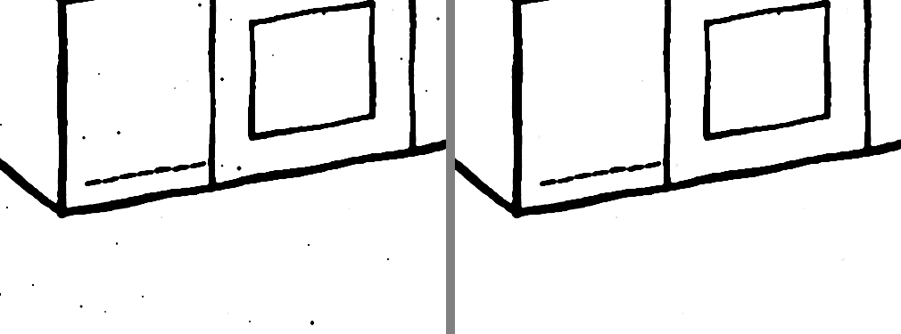
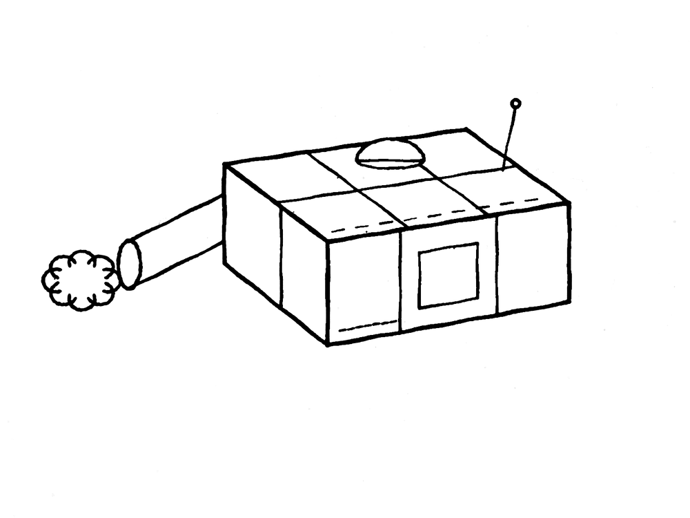
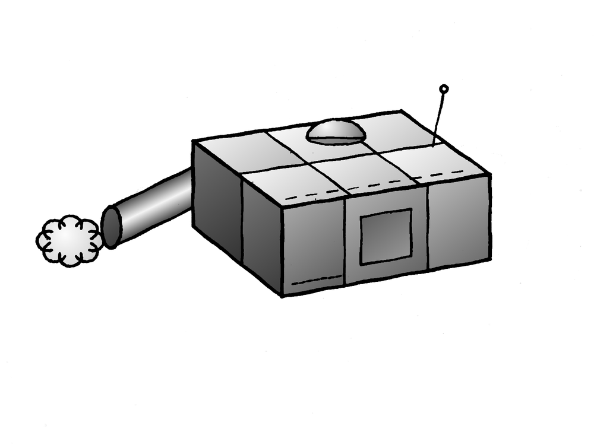

# Restoring old ink art

How to take a scan or phone photo of an ink drawing on aged paper and end up with clean black line work you can shade or colour, without touching the original. Needs Easeletch 0.5 or later (0.6 for the Heal and Clone tools, 0.7 for Shade Areas).

The drawing used here was made for this guide. Yours will have the same problems: paper that has gone brown, uneven light, print showing through from the other side of the page, stains and dust.

## 1. Open the scan and keep a copy of it

1. **File > Open** (Ctrl+O) and pick the image.
2. Press **Ctrl+D** so nothing is selected. A selection left over from earlier limits every tool to that one area.
3. Press **Ctrl+J** to duplicate the layer, and double-click the copy's name to call it *Line art*. Everything below is done to the copy. The original stays underneath as *Background*, there if you want to start again or compare.
4. **File > Save As** and give it a name. From here on Ctrl+S saves an `.easeletch` document with all its layers.

## 2. Turn the paper white with Threshold

A Threshold layer makes everything lighter than its level white and everything darker black. Paper, stains and show-through are all lighter than ink, so they go at once.

1. With *Line art* selected, choose **Layer > New Adjustment Layer > Threshold**.
2. In the Adjustment panel, drag **Level** up from 0. The paper turns white from its brightest part outward. Keep going until the darkest corner of the paper is white, and stop before thin lines start to break up. On most scans that is somewhere between 80 and 130; the example uses 95.
3. Set **Soften edges** to about 30%. At 0% every pixel is pure black or pure white and lines look stepped; a little softening keeps them smooth.

The layer changes nothing underneath, so you can move the level back and forth as long as you like.

If one level can't suit the whole page (a corner in shadow goes black before the middle is clean), set the level for the drawing itself and deal with the dark corner afterwards: select it with the Lasso and press Delete, or paint over it in white.

## 3. Make the change permanent

Select the Threshold layer and press **Ctrl+E** (Merge Down). *Line art* now holds real black and white pixels. The next steps need that: Despeckle and the magic wand work on a layer's own pixels, not on what an adjustment layer above makes them look like.

## 4. Remove the dust with Despeckle

What's left are the marks that were as dark as the ink: dust, fibres, flecks in the paper.

1. Choose **Filter > Despeckle**. The canvas shows the result as you change the settings.
2. Raise **Speck size** until the dots are gone. It is the area, in pixels, of the largest mark removed; the example uses 45. Anything bigger is left exactly as it was, so lines, corners and soft edges are not touched.
3. Watch the smallest real details in the drawing (dashes, dots, the hole in a small ring) while you raise it. When one of them disappears, come back down.
4. Leave **Tolerance** at 15%. Click OK.

A mark too big for Despeckle without losing detail is quicker to remove by hand: press **H** for the Heal tool and dab it, or lasso it (L) and press Delete.

To clean one part of the picture harder than the rest, select that part first. Despeckle then only works inside the selection.

That is the restoration. **File > Export** (Ctrl+Shift+E) writes a PNG. The rest is optional.

### Repairing damage (0.6 and later)

Two tools fix what the steps above can't, and both also work straight on the scan if you'd rather keep the look of the paper than turn it white.

- **Heal (H)** removes a stain, a scratch or a blot. Set the size a little bigger than the mark, dab it (or drag along it) and let go. It's replaced with a nearby piece of the same layer, toned to match, so on paper the grain carries across. It works best where the mark sits on an open area. Where a line of the drawing runs through the mark it has to guess, and may bend or double the line; undo and use Clone there.
- **Clone (C)** copies one part of the layer onto another. Hold **Alt** and click what to copy (an intact stretch of a line, say), then paint over the gap. A diamond shows where the copy is coming from. Each new stroke carries on the same copy; Alt+click again to copy from somewhere else.

## 5. Shade or colour under the lines

Put the colour on a layer of its own, set to Multiply, above the line art. Multiply darkens what is below it, so the black lines always show through and never get painted over.

1. Press **Ctrl+Shift+N** for a new layer, name it *Shading*, and set its blend mode (top of the Layers panel) to **Multiply**.
2. Click *Line art* in the Layers panel, press **W** for the magic wand, and click inside an area of the drawing. The wand reads the layer that's selected, which is why you click *Line art* first.
3. **Edit > Grow Selection** by 2 or 3 pixels. This tucks the colour under the soft edge of the line so no white fringe is left.
4. Click *Shading* in the Layers panel. The selection stays.
5. Press **Shift+G** for the Gradient tool, choose its colours and shape in the tool options, and drag across the area. For one flat colour, use **Edit > Fill with Colour** (Shift+F5) instead.
6. Press **Ctrl+D** and go on to the next area.

### All the panels at once (0.7 and later)

For a drawing made of many panels, **Layer > Shade Areas** does the steps above for every enclosed area in one go, on a Multiply layer it adds for you.

1. Click *Line art* in the Layers panel and choose **Layer > Shade Areas**. Pick a gradient (Soft shading, or a metal), set the **Angle** the light falls at, and press OK. Every panel is now shaded.
2. For the faces turned away from the light, press **L** and click loosely round that group of panels; they only need to be mostly inside. Run Shade Areas again with **Brightness** lowered. It replaces the shading on just those panels.
3. Repeat for each face: three or four passes shade a whole object.
4. For coloured metal, pick the colour first and tick **Tint with the current colour**.

Close any gaps in the lines first (a small brush stroke in black): a panel with a gap in its outline isn't enclosed, and joins its neighbour or the page. Tubes and domes still look best done by hand with a Reflected or Radial gradient, as below.

What makes flat areas look solid:

| Surface | Gradient |
| --- | --- |
| Flat faces | Linear. Drag at the same angle on every area that faces the same way, lighter for faces turned to the light, darker for those turned away. |
| Tubes and rods | Reflected. Start the drag on the centre line and pull out to the edge. |
| Balls and domes | Radial, with the colours set to "Colour, shaded". Start the drag where the highlight should be. |
| Metal | Any of the above with a metal preset: Steel, Chrome, Gunmetal, Gold, Copper. |

## When something goes wrong

| What happens | Why, and what to do |
| --- | --- |
| A tool does nothing, or only works in one spot | Something is selected, perhaps off screen. The status bar shows its size. Ctrl+D deselects. |
| The wand selects two areas at once | A line between them has a gap. Close it with a small brush stroke in black on *Line art*, or select the area with the Lasso instead: press L and click its corners, then Enter. |
| The wand misses a corner | Hold Shift and lasso the missed part to add it. Ctrl takes away. |
| Lines came out thin or broken after Threshold | The level was too low for faint ink. Undo back to the Threshold layer and lower the level a little, or brush the breaks closed. |
| Despeckle took a small detail | Undo, and use a smaller Speck size, or select around the detail and press Ctrl+Shift+I to work on everything except it. |
| An older build won't open the document | A Threshold layer that hasn't been merged down needs 0.5. Merge it (step 3) and save again. |
